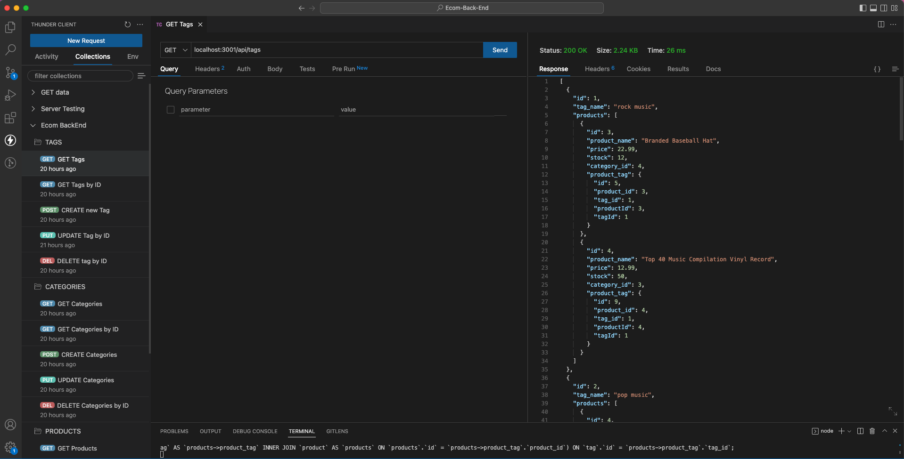

# ECOM-BACK-END

## Description
The purpose of this application is to provide a back-end solution for an internet retail company's e-commerce website. It is intended for use by the manager of the company and allows them to perform various operations on the items/inventory in the database, such as creating new items, reading existing items, updating item information, and deleting items. In order to use the application, the user must follow the instructions provided in the installation section of the documentation. These instructions will guide the user through the process of setting up the application and getting it ready for use. Once the application is [installed](#installation) and configured, the user will be able to use the various tools provided to manage the company's e-commerce website and its inventory.

## Table of Contents
* [Installation](#installation)
* [Links](#Links)
* [Usage](#usage)
* [License](#license)
* [Contribute](#contribute)
* [Tests](#tests)
* [Questions](#questions)

## Installation
If you want to run a copy of this app on your local machine, first clone the repository:

Clone Via HTTPS:
```console
$ git clone https://github.com/Steven-McCombe/staff-tracker.git
```

Clone Via SSH:
```console
~$ git clone git@github.com:Steven-McCombe/staff-tracker.git
```

Create a new .env file with the following variables. This should allow the server to connect to mySQL.
```js
DB_NAME='ecommerce_db'
DB_PW='[input your sql password]'
DB_USER='[input your sql username]'
```

Cd/ into the cloned directory and install the dependencies by typing the following into the command line
```
$ npm install --save
```
Input the following code to seed the database.
```
$npm run seed
```

Input the following code to run the server file.
```
$ npm run start
```

View the data by opening one of the following URL in your browser:
```h
http://localhost:3001/api/products
http://localhost:3001/api/tags
http://localhost:3001/api/categories
```

## Usage
Video Demonstration (click image):

[](https://drive.google.com/file/d/1GzzNZ8cXSm_oJl4bE6v39pGA6XrzF7cs/view)

## License 
   

  [Read more about MIT License here.](https://opensource.org/licenses/MIT)
  
  
## Contribute
N/A

## Tests
N/A

## Questions
Contact Links:
- [Github Profile](https://github.com/STEVEN-MCCOMBE)
- [E-mail Me](mailto:smccombe93@gmail.com)


